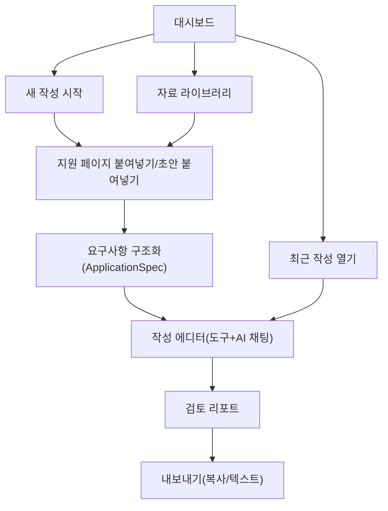

# 03. 정보구조(IA)와 내비게이션

## 1) IA 설계 원칙
- 사용자 입장에서 메뉴보다 "작성 흐름"이 먼저 보이게 한다.
- 문서 보관(자료 라이브러리)과 문서 생산(작성 세션)을 분리한다.
- 지원 형식 메뉴를 세분화하지 않고, 지원 페이지 파싱 결과 중심으로 안내한다.
- 작성 중에는 산만한 옵션을 줄이고 핵심 액션만 노출한다.

## 2) 상위 메뉴 구조
1. `대시보드`
2. `자료 라이브러리`
3. `설정` (Self-hosted 환경 기본 설정)

`내보내기`는 독립 메뉴가 아니라 작성 세션 및 검토 화면 안의 액션으로 제공한다.

## 3) 화면 구조 맵

## 4) 작성 세션 중심 구조
작성 세션은 하나의 단위로 아래 정보를 묶는다.

- 목표: 회사, 직무, 문항, 글자수 제한 (지원 페이지 파싱 결과 포함)
- 입력 소스: 사용자 초안, 선택 자료(이력서/포트폴리오/기존 자소서)
- 결과물: 초안/수정본/최종본 버전
- 검토 결과: 분량, 적합도, 개선 포인트
- 신뢰 상태: 근거 기반 문장 / AI 추론 문장 구분

## 5) 내비게이션 디테일

### 대시보드 진입 시 기본 CTA
- `지원 페이지 붙여넣고 시작`: 문항/제약 자동 추출 후 작성 시작
- `기존 초안 붙여넣고 시작`: 현재 글 기반 개선
- `자료 선택 후 시작`: 업로드 자료 기반 초안 생성

### 작성 에디터 상단 고정 컨트롤
- 회사/직무/문항/글자수 제한 표시
- 현재 글자수 및 제한
- 미확정(근거 부족) 문장 개수
- 문항 탭(공고 내 복수 문항 동시 편집)
- 버전 저장/복원
- 검토 실행 버튼
- 자동 검토 토글(수동/자동, 자동은 3초 유휴 후 실행)

### 작성 에디터 보조 패널
- 좌측: 자료 근거 패널
- 우측 상단: 도구 메뉴(다른 소재 찾기, 질문 적합성 개선, 가독성 개선 등)
- 우측 하단: AI 채팅 패널(도구 선택 시 프롬프트 자동 전송)
