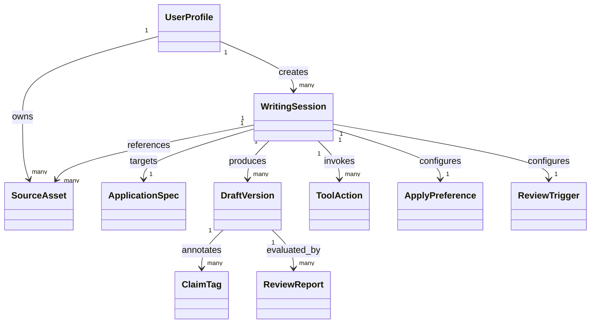

# 05. 핵심 도메인 모델 (심플 버전)

## 1) 왜 도메인 모델이 필요한가
요구 기능이 많아질수록 화면 중심 설계만으로는 확장이 어렵다.  
초기에는 최소 개념만 정의해서 UX 단순성을 유지하고, 이후 기능 확장에 대비한다.

## 2) 최소 도메인 개념

### `UserProfile`
- 작성자 기본 프로필
- 예: 경력 단계(신입), 희망 직무, 주요 기술 키워드

### `SourceAsset`
- 초안 생성/편집의 근거가 되는 자료
- 타입: 이력서, 포트폴리오, 기존 자기소개서, 메모

### `ApplicationSpec`
- 지원 페이지 텍스트에서 추출한 목표 구조
- 예: 회사명, 직무, 질문 문항 배열, 문항별 글자수 제한, 공통 안내사항

### `WritingSession`
- 실제 작업 단위
- 선택된 목표(ApplicationSpec) + 선택된 자료(SourceAsset) + 생성/편집 기록
- 단위 규칙: 1세션 = 1지원 공고

### `DraftVersion`
- 작성 결과물 버전
- 예: 초안, 사용자 수정본, 최종본

### `ClaimTag`
- 본문 문장(또는 문장 묶음)의 근거 상태
- 상태: `SUPPORTED`(자료 근거 있음), `INFERRED`(AI 추론 추가)
- 표시 데이터: 문장 위치(span), 참조 자료, 사용자 확정 여부

### `ToolAction`
- 도구 메뉴에서 실행된 액션 로그
- 예: "질문 적합성 개선", "가독성 개선", 실행 시점, 연동된 AI 채팅 메시지 ID

### `ApplyPreference`
- AI 수정 적용 설정
- 상태: `MANUAL_REVIEW`(기본), `AUTO_APPLY`(사용자 토글)
- 적용 범위: `SELECTION_ONLY`, `WHOLE_DOCUMENT`

### `ReviewTrigger`
- 검토 실행 방식
- 상태: `MANUAL`, `AUTO`, `BOTH`
- 자동 검토 시 유휴 시간(debounce) 3초

### `ReviewReport`
- 초안에 대한 품질 점검 결과
- 예: 질문 적합도, 근거성, 가독성, 미확정(INFERRED) 문장 목록

## 3) 관계 요약

## 4) 설계 포인트
- `WritingSession`을 중심으로 묶으면 "초안 편집"과 "자료 기반 생성"을 같은 구조로 다룰 수 있다.
- `DraftVersion`을 분리하면 사용자 실수 복구와 품질 비교가 쉽다.
- `ClaimTag`를 두면 AI 추론 문장을 시각적으로 분리하고 사용자 확인 루프를 강제하기 쉽다.
- `ToolAction`을 분리하면 도구 메뉴와 AI 채팅 연동 UX를 일관되게 추적할 수 있다.

## 5) 초기 단계에서 의도적으로 제외한 개념
- 복잡한 조직/권한 모델
- 상세 평가 프레임워크 버전 관리
- 회사별 채용 공고 파이프라인 모델
